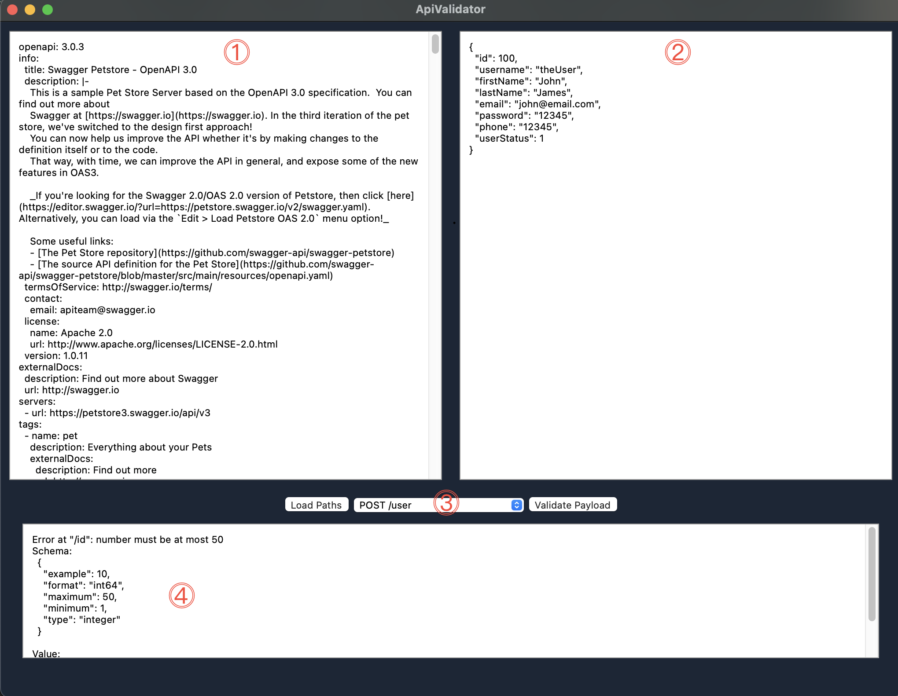

# apivalidator
Simple Go app with Wails and Vue.js to test Swagger/OpenAPI Request against API specification.

## About

Ever wondered if your request to a API passes all the  schema validations through sometimes multiple gateways and differing constrains? 
Afraid of hitting a rate limit while trying to figure out how your requests should look like?

Well this is the tool for you. Just paste a valid OpenApi or Swagger definition on the left, your request on the right, select the corresponding path and operation and hit the _validate_ button.

If your request wouldn't match, e. g. because a string is too long or a number outside the allowed range, you'll see the reason why.

## Usage

### Installation 

Either head to the releases and download the executable for your system or
use the sourcecode directly.

__Neither the MacOS nor the Windows Version are signed! You'll get a warning when starting the app. 
Proceed at your own risk!__  
Running from source won't throw a warning at you.

### Requirements for running from source

You'll need Go and Wails to get the app running from source:

* Go -> [Install Go](https://go.dev/doc/install)
* Wails (also needs NPM) -> [Install Wails](https://wails.io/docs/gettingstarted/installation)

After you've installed Go and Wails, just clone this repo and execute `wails dev`

## Basic Usage

Once you've stared the app you'll see a window with four fields:

1. Post your API schema here
2. Post your request payload here
3. Hit 'Load Paths', select the path and operation you want to use and push 'validate'
4. If there are any errors in your request, they are displayed here  
   In this example the allowed range for 'id' is from 1 to 50 but we tried 100

### Limitations

* Swagger V2.x and OpenAPI V3.x is supported
* only payload validation is available